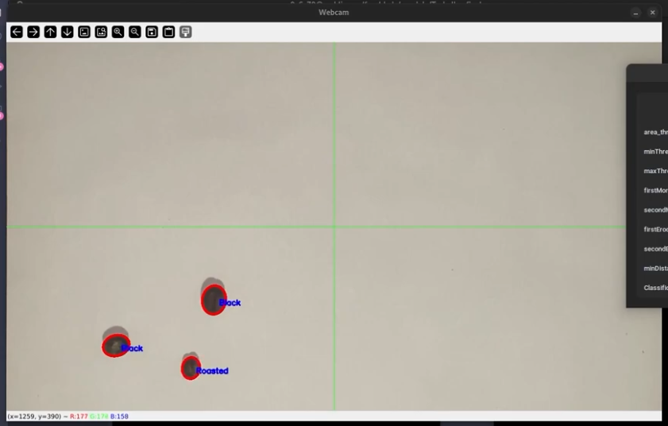
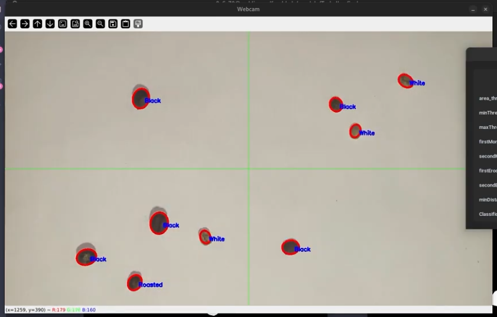

# Parallel Coffee Counter

O Parallel Coffee Counter é um sistema de processamento paralelo desenvolvido como projeto final da disciplina de Computação Paralela da Universidade Federal de Alfenas (UNIFAL-MG). O projeto implementa algoritmos de visão computacional para identificação, classificação e contagem automática de grãos de café, utilizando programação paralela com MPI4Py para otimizar o desempenho do processamento.

## Objetivos
O sistema foi desenvolvido com os seguintes objetivos:

- Identificação automática de grãos de café em imagens
- Classificação dos grãos identificados segundo critérios específicos
- Contagem precisa do número de grãos presentes nas imagens
- Processamento paralelo para melhorar a eficiência computacional
- Comparação de desempenho entre implementações sequenciais e paralelas

## Tecnologias Utilizadas

- Python: Linguagem principal do projeto
- MPI4Py: Biblioteca para implementação de paralelismo usando Message Passing Interface
- OpenCV: Processamento de imagens e visão computacional
- NumPy: Manipulação de arrays e operações matemáticas

## Arquitetura do Sistema
O sistema distribui o processamento de imagens entre múltiplos processos, dividindo a carga de trabalho e sincronizando os resultados finais. A abordagem paralela permite processar grandes volumes de imagens de forma eficiente.
Fluxo de Processamento

## Carregamento e pré-processamento das imagens
1. Distribuição das tarefas entre os processos MPI
2. Detecção e segmentação dos grãos de café
3. Classificação individual de cada grão
4. Agregação dos resultados e contagem final

## Resultados

## Instituição
Universidade Federal de Alfenas (UNIFAL-MG)
Curso: Ciência da Computação
Disciplina: Computação Paralela